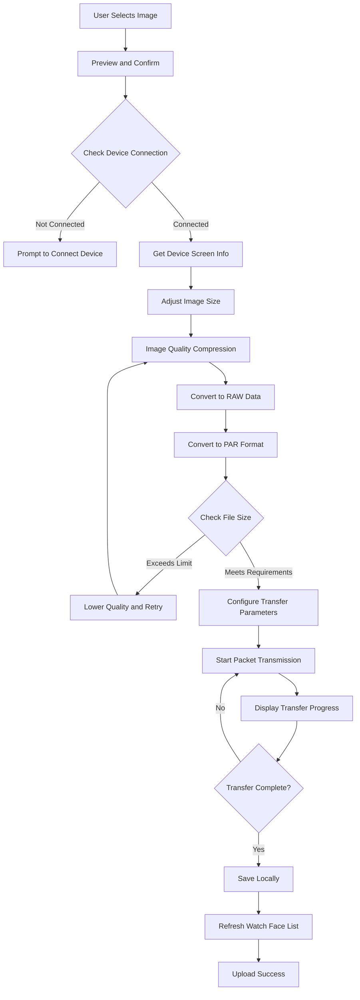

# SmartBracelet Custom Watch Face Upload Documentation

**Version**: v2.0
**Date**: 2026-01-14
**SDK**: WatchFaceSDK v1.0.3 + WatchProtocolSDK v1.0.2

---

## 📋 Table of Contents

1. [Feature Overview](#feature-overview)
2. [Technical Architecture](#technical-architecture)
3. [Upload Flow](#upload-flow)
4. [Core API Usage](#core-api-usage)
5. [Image Processing Details](#image-processing-details)
6. [Device Compatibility](#device-compatibility)
7. [Error Handling](#error-handling)
8. [Best Practices](#best-practices)
9. [Code Examples](#code-examples)
10. [FAQ](#faq)

---

## Feature Overview

### What is Custom Watch Face?

The custom watch face feature allows users to upload their own photos to the smartwatch as personalized watch face backgrounds.

### Key Features

- ✅ Support multiple image formats (PNG, JPG, HEIC)
- ✅ Automatic image cropping and resizing
- ✅ Smart compression to device-required size
- ✅ PAR format conversion (device-specific format)
- ✅ Real-time upload progress display
- ✅ Multiple device model support
- ✅ Adaptive for round and square screens

### Supported Devices

| Device Type | Screen Size | Screen Shape | File Size Limit |
|------------|-------------|--------------|-----------------|
| XGZT Series | 240×280, 240×296, etc. | Square/Round | ≤ 120KB |
| ZhongKe Series (5A4B) | 240×240 | Square | ≤ 120KB |
| JieLi Series (JL) | Various | Square/Round | ≤ 150KB |
| Other Series | 80×160, 128×128, etc. | Square/Round | ≤ 28-100KB |

---

## Technical Architecture

### System Architecture Diagram

```
┌─────────────────────────────────────────────────┐
│              User Interface Layer                │
│  MyClockViewController                          │
│  UploadImageViewController                      │
└─────────────────────┬───────────────────────────┘
                      │
┌─────────────────────┴───────────────────────────┐
│           Image Processing Layer                 │
│  • Image Selection (TZImagePickerController)     │
│  • Size Adjustment (resizeImage)                 │
│  • Quality Compression (compressImage)           │
│  • RGB Reduction (resizeAndReduceRGB)            │
└─────────────────────┬───────────────────────────┘
                      │
┌─────────────────────┴───────────────────────────┐
│          Format Conversion Layer                 │
│  • RAW Data Extraction (rawImageData)            │
│  • PAR Format Conversion (ABParTool)             │
│  • Size Validation                               │
└─────────────────────┬───────────────────────────┘
                      │
┌─────────────────────┴───────────────────────────┐
│          Transfer Protocol Layer                 │
│  WatchProtocolSDK                               │
│  • XGZT Protocol                                │
│  • ZhongKe Protocol (5A4B)                      │
│  • JieLi Protocol (JL)                          │
└─────────────────────┬───────────────────────────┘
                      │
┌─────────────────────┴───────────────────────────┐
│          Bluetooth Transfer Layer                │
│  • BLE Communication                            │
│  • MTU Adaptation                               │
│  • Packet Transmission                          │
│  • Retransmission Mechanism                     │
└─────────────────────────────────────────────────┘
```

### Core Dependencies

```swift
import UIKit
import ABParTool           // PAR format conversion
import WatchProtocolSDK    // Watch communication protocol
import TJDWristbandSDK     // Wristband SDK
```

---

## Upload Flow

### Complete Flow Diagram



### Detailed Step Descriptions

#### Stage 1: Image Selection and Preprocessing

**1. User Selects Image**
```swift
// Use TZImagePickerController to select image
let imagePickerVc = TZImagePickerController(
    maxImagesCount: 1,
    delegate: self
)
present(imagePickerVc, animated: true)
```

**2. Display Preview Interface**
```swift
// UploadImageViewController displays image preview
imageUploadVc = UploadImageViewController()
imageUploadVc?.image = selectedImage
imageUploadVc?.delegate = self
present(imageUploadVc, animated: true)
```

#### Stage 2: Image Processing

**3. Get Device Screen Information**
```swift
// Get device screen size
let w = isXGZT ?
    CGFloat(XGZTBlueToothManager.shared.device?.screenWidth ?? 0) :
    CGFloat(bleSelf.bleModel.screenWidth)

let h = isXGZT ?
    CGFloat(XGZTBlueToothManager.shared.device?.screenHeight ?? 0) :
    CGFloat(bleSelf.bleModel.screenHeight)
```

**4. Adjust Image Size**
```swift
/// Resize image to target size
private func resizeImage(_ image: UIImage, to targetSize: CGSize) -> UIImage? {
    let format = UIGraphicsImageRendererFormat.default()
    format.scale = 1.0 // Avoid device scaling effects

    return UIGraphicsImageRenderer(size: targetSize, format: format).image { _ in
        image.draw(in: CGRect(origin: .zero, size: targetSize))
    }
}
```

**5. Image Compression Loop**
```swift
var image = resizedImage
let targetSizeBytes = 120 * 1024  // 120KB
var attemptCount = 0
let maxAttempts = 10

while attemptCount < maxAttempts {
    // Get raw image data
    guard let rawImageData = image.rawImageData else {
        return
    }

    // Convert to PAR format
    if let parData = ParTool.par(
        fromRaw: rawImageData,
        width: Int32(targetSize.width),
        height: Int32(targetSize.height),
        runAlpha: false,
        useFilter: false,
        supportRotate: false
    ) {
        if parData.count <= targetSizeBytes {
            // Success! Size meets requirements
            binData = parData
            break
        } else {
            // Continue compressing
            let quality = max(0.1, 0.9 - Double(attemptCount) * 0.1)
            if let compressedData = image.jpegData(compressionQuality: quality),
               let compressedImage = UIImage(data: compressedData) {
                image = compressedImage
            }
        }
    }

    attemptCount += 1
}
```

#### Stage 3: Transfer Configuration

**6. Configure Transfer Parameters**
```swift
// Calculate packet count
let binsize = binData.count
let mtu = XGZTBlueToothManager.shared.device?.mtu ?? 0
var packageTotal = 0

if binsize % 200 == 0 {
    packageTotal = binsize / 200
} else {
    packageTotal = binsize / 200 + 1
}

// Send transfer configuration
XGZTCommand.dialMarketSetTransferConfig(
    packageTotal: packageTotal,
    binSize: binsize,
    mtu: mtu,
    dialType: 1,        // Custom watch face
    dialNum: 1,
    local: diallocation,
    typeValue: 0,
    dialTypeValue: colorIndex
)
```

#### Stage 4: Packet Transmission

**7. Transmit Data Packets**
```swift
packageNum += 1
let maxDataLength = 200
let bin = (packageNum - 1) * maxDataLength
let progress = bin * 100 / binData.count

// Calculate current packet data range
let a = min(bin + maxDataLength, binData.count)
let range = bin..<a
let subData = binData.subdata(in: range)

// Determine if this is the last packet
var control = 0
if bin + maxDataLength >= binData.count {
    control = 1  // Last packet
}

// Send data packet
XGZTCommand.dialMarketTransferData(
    packageNum: packageNum,
    binNum: bin,
    progressBar: progress,
    control: control,
    data: subData
)
```

**8. Update Progress Display**
```swift
let d = Float(bin * 100) / Float(binData.count)
let s = String(format: "%.02f%%", d)

DispatchQueue.main.async {
    [weak self] in
    self?.imageUploadVc?.refreshProgress(p: s)
}
```

#### Stage 5: Completion Handling

**9. Upload Success Handling**
```swift
private func notif() {
    let timestamp = Int(Date().timeIntervalSince1970)

    // Show success message
    Toast(text: "toast_success".localized()).show()

    // Save image locally
    let w = isXGZT ?
        (XGZTBlueToothManager.shared.device?.screenWidth ?? 0) :
        bleSelf.bleModel.screenWidth
    let h = isXGZT ?
        (XGZTBlueToothManager.shared.device?.screenHeight ?? 0) :
        bleSelf.bleModel.screenHeight

    saveImage(
        currentImage: currentImage!,
        imageName: "\(lastestDeviceMac)_\(w)_\(h)_\(timestamp).png"
    )

    // Save to UserDefaults
    var clockDir = UserDefaults.standard.dictionary(forKey: "MyClock") ?? [:]
    var clockStr = clockDir[lastestDeviceMac] as? [String] ?? ["_&&_&&_", "_&&_&&_", "_&&_&&_"]

    let imageN = "\(lastestDeviceMac)_\(w)_\(h)_\(timestamp).png"
    let fullPath = NSHomeDirectory().appending("/Documents/").appending(imageN)

    clockStr[index] = "\("custom_watch_face".localized())&&\(imageN)&&\(fullPath)"
    clockDir[lastestDeviceMac] = clockStr

    UserDefaults.standard.setValue(clockDir, forKey: "MyClock")
    UserDefaults.standard.synchronize()

    // Dismiss upload interface
    imageUploadVc?.dismiss(animated: false)

    // Refresh list
    tableView?.reloadData()
}
```

---

## Core API Usage

### Using WatchFaceSDK v1.0.3 (Recommended)

The project has now migrated to using WatchFaceSDK.xcframework. Recommended implementation:

```swift
import WatchFaceSDK
import WatchProtocolSDK

class CustomWatchFaceUploader {

    /// Upload custom watch face
    func uploadCustomWatchFace(image: UIImage, delegate: TransferDelegate?) {
        do {
            // Use WatchFaceSDK's high-level API
            try WatchFaceManager.shared.uploadCustomWatchFace(
                image: image,
                timePosition: .center,     // Time position
                color: .white,             // Text color
                delegate: delegate
            )
        } catch let error as WatchFaceError {
            // Handle WatchFaceSDK-specific errors
            handleWatchFaceError(error)
        } catch {
            // Handle other errors
            print("Upload failed: \(error)")
        }
    }

    /// Handle WatchFace errors
    private func handleWatchFaceError(_ error: WatchFaceError) {
        switch error {
        case .deviceNotConnected:
            showAlert("Device not connected")
        case .deviceNotSupported:
            showAlert("Device does not support custom watch face")
        case .imageProcessFailed:
            showAlert("Image processing failed")
        case .rawDataConversionFailed:
            showAlert("Image data conversion failed")
        case .compressionFailed:
            showAlert("Image compression failed")
        case .exceedMaxAttempts:
            showAlert("Cannot compress image to required size")
        default:
            showAlert("Upload failed")
        }
    }
}

// MARK: - TransferDelegate
extension CustomWatchFaceUploader: TransferDelegate {

    func transferDidStart() {
        print("🚀 Starting watch face upload")
        // Show upload interface
    }

    func transferDidUpdateProgress(_ progress: TransferProgress) {
        let percentage = Int(progress.percentage * 100)
        print("📊 Upload progress: \(percentage)%")
        // Update progress bar
    }

    func transferDidComplete() {
        print("✅ Watch face uploaded successfully")
        // Save record, refresh list
    }

    func transferDidFail(error: Error) {
        print("❌ Upload failed: \(error.localizedDescription)")
        // Show error message
    }
}
```

### Time Position Configuration

```swift
/// Time position enumeration
public enum TimePosition: Int {
    case topLeft = 1        // Top left
    case bottomLeft = 2     // Bottom left
    case topRight = 3       // Top right
    case bottomRight = 4    // Bottom right
    case center = 5         // Center (recommended)
}
```

### Watch Face Color Configuration

```swift
/// Watch face text color
public enum DialColor: Int {
    case white = 0      // White (recommended for dark backgrounds)
    case black = 1      // Black (recommended for light backgrounds)
    case yellow = 2     // Yellow
    case orange = 3     // Orange
    case pink = 4       // Pink
    case purple = 5     // Purple
    case blue = 6       // Blue
    case cyan = 7       // Cyan
    case green = 8      // Green
}
```

---

## Image Processing Details

### PAR Format Introduction

**PAR** (Proprietary Anker Raster) is a device-specific image format with the following characteristics:

- High compression ratio (typically 30-50% smaller than JPEG)
- Optimized for small screens
- Fast decoding
- Low memory footprint

### rawImageData Implementation

```swift
/// UIImage extension: Get raw image data
/// Note: This implementation is provided by ABParTool.framework
extension UIImage {
    var rawImageData: Data? {
        // ABParTool's Objective-C implementation
        // Returns ARGB format raw pixel data
    }
}
```

**Important**: SmartBracelet project now uses `rawImageData` provided by ABParTool.framework, no longer uses custom implementation, avoiding the v1.0.2 crash issue.

### PAR Conversion Parameters

```swift
ParTool.par(
    fromRaw: rawImageData,    // Raw ARGB data
    width: Int32,             // Image width
    height: Int32,            // Image height
    runAlpha: Bool,           // Run alpha compression
    useFilter: Bool,          // Use filter
    supportRotate: Bool       // Support rotation
)
```

**Recommended Parameters**:
- `runAlpha: false` - Not needed in most scenarios
- `useFilter: false` - Preserve original colors
- `supportRotate: false` - Watch doesn't need rotation

### RGB Reduction Processing

Some low-end devices require reducing color depth:

```swift
/// Reduce RGB from 256 levels to 64 levels
private func resizeAndReduceRGB(image: UIImage, targetSize: CGSize) -> UIImage? {
    // Create graphics context
    UIGraphicsBeginImageContextWithOptions(targetSize, false, 1.0)
    image.draw(in: CGRect(origin: .zero, size: targetSize))
    let resizedImage = UIGraphicsGetImageFromCurrentImageContext()
    UIGraphicsEndImageContext()

    guard let cgImage = resizedImage?.cgImage else {
        return nil
    }

    // Create modifiable bitmap context
    let context = CGContext(/* ... */)
    context.draw(cgImage, in: CGRect(x: 0, y: 0, width: width, height: height))

    // Reduce RGB values
    if let pixelData = context.data {
        let data = pixelData.bindMemory(to: UInt8.self, capacity: width * height * 4)
        for y in 0..<height {
            for x in 0..<width {
                let index = (y * width + x) * 4
                // 256 levels -> 64 levels: divide by 4 then multiply by 4
                data[index] = (data[index] / 4) * 4         // R
                data[index + 1] = (data[index + 1] / 4) * 4 // G
                data[index + 2] = (data[index + 2] / 4) * 4 // B
            }
        }
    }

    return UIImage(cgImage: context.makeImage()!)
}
```

---

## Device Compatibility

### XGZT Series Devices

**Feature Identification**:
```swift
let isXGZT = XGZTBlueToothManager.shared.device != nil
```

**Screen Sizes**:
- 240×280 (common)
- 240×296
- Other square sizes

**Transfer Protocol**:
```swift
// Configure transfer
XGZTCommand.dialMarketSetTransferConfig(
    packageTotal: packageTotal,
    binSize: binsize,
    mtu: mtu,
    dialType: 1,
    dialNum: 1,
    local: diallocation,
    typeValue: 0,
    dialTypeValue: colorIndex
)

// Transfer data
XGZTCommand.dialMarketTransferData(
    packageNum: packageNum,
    binNum: bin,
    progressBar: progress,
    control: control,
    data: subData
)
```

### ZhongKe Series (5A4B)

**Feature Identification**:
```swift
let isZhongKe = bleSelf.bleModel.internalNumber.hasPrefix("5A4B")
```

**Characteristics**:
- MTU adaptation: `bleSelf.bleModel.MTU - 4`
- Requires responsive transmission (send next packet after receiving confirmation)
- 240×240 standard size

**Transfer Method**:
```swift
if isZhongKe {
    let mtuSize = bleSelf.bleModel.MTU > 16 ? bleSelf.bleModel.MTU - 4 : 16
    bleSelf.setImagePush(binData, dataIndex: currentPackage, MTU: mtuSize)
}
```

### JieLi Series (JL)

**Feature Identification**:
```swift
let isJL = bleSelf.isJLBlue
```

**Special Handling**:
```swift
if isJL {
    // Initialize
    JLSelf.getFlashInfo()
    JLSelf.btn_List()

    // More lenient compression requirements
    let imageData = image.compressImageOnlength(maxLength: 50)

    // Check battery level
    if bleSelf.batteryLevel <= 15 {
        showAlert("Device battery low, please charge first")
        return
    }
}
```

### Other Series

**Small Screen Devices** (80×160):
```swift
if w == 80 && h == 160 {
    let imageData = image.compressImageOnlength(maxLength: 28)
    // Use smaller file
}
```

**Standard Devices**:
```swift
let imageData = image.compressImageOnlength(maxLength: 100)
```

---

## Error Handling

### Common Errors and Handling

#### 1. Device Not Connected

```swift
if !bleSelf.isConnected && XGZTBlueToothManager.shared.device == nil {
    Toast(text: "mine_unconnect".localized()).show()
    return
}
```

#### 2. Image Too Large

```swift
if attemptCount >= maxAttempts {
    XLogger.shared.log("Exceeded max attempts, cannot meet file size requirement")
    showAlert("Image file too large, please select another image")
    return
}
```

#### 3. Device Battery Low

```swift
if bleSelf.batteryLevel <= 15 {
    showAlert("Device battery low, please charge device first")
    return
}
```

#### 4. PAR Conversion Failed

```swift
guard let parData = ParTool.par(/* ... */) else {
    XLogger.shared.log("Failed to convert to PAR format")
    showAlert("Image format conversion failed")
    return
}
```

#### 5. Transfer Interrupted

```swift
@objc func handleNotifyXGZT(_ notification: Notification) {
    let obj = notification.object as? Int ?? 0

    if obj == 7 {  // Transfer failed
        packageNum = 0
        binData = Data()
        imageUploadVc?.dismiss(animated: false)
        showAlert("Upload failed, please retry")
    }
}
```

### Error Recovery Mechanism

```swift
/// Support pause and resume
var needStop = false

deinit {
    needStop = true  // Stop transmission
    binData = Data() // Clear data
}
```

---

## Best Practices

### 1. Image Selection Recommendations

✅ **Recommended**:
- Select clear, high-contrast images
- Avoid overly complex patterns
- Photos with prominent subjects work best
- Resolution no lower than target screen size

❌ **Not Recommended**:
- Images too small (will blur)
- Solid color images (waste of storage)
- Overly complex patterns (distortion after compression)

### 2. Performance Optimization

```swift
// ✅ Good practice: Process images asynchronously
DispatchQueue.global(qos: .userInitiated).async {
    let processedImage = self.processImage(image)

    DispatchQueue.main.async {
        self.uploadImage(processedImage)
    }
}

// ❌ Avoid: Processing large images on main thread
let processedImage = processImage(image)  // Will freeze UI
```

### 3. Memory Management

```swift
// ✅ Release large objects promptly
func uploadComplete() {
    binData = Data()        // Clear binary data
    currentImage = nil      // Release image
    imageUploadVc = nil     // Release controller
}

// ✅ Use autoreleasepool
for i in 0..<total {
    autoreleasepool {
        bleSelf.setImagePush(binData, dataIndex: i, MTU: mtuSize)
    }
}
```

### 4. User Experience

```swift
// ✅ Keep screen awake
UIApplication.shared.isIdleTimerDisabled = true

// ✅ Display progress
imageUploadVc?.refreshProgress(p: "\(percentage)%")

// ✅ Provide timely feedback
Toast(text: "Upload successful").show()

// ✅ Restore after completion
deinit {
    UIApplication.shared.isIdleTimerDisabled = false
}
```

### 5. Logging

```swift
// ✅ Log critical steps
XLogger.shared.log("🔄 Starting image resize: \(width)x\(height)")
XLogger.shared.log("📦 PAR data size: \(parData.count) bytes")
XLogger.shared.log("📊 Upload progress: \(progress)%")
XLogger.shared.log("✅ Upload complete")
```

---

## Code Examples

### Complete Example: Custom Watch Face Upload

```swift
import UIKit
import WatchFaceSDK
import WatchProtocolSDK
import TZImagePickerController

class CustomWatchFaceViewController: UIViewController {

    // MARK: - Properties

    private var currentImage: UIImage?
    private var uploadViewController: UploadImageViewController?

    // MARK: - Actions

    /// Select image
    @IBAction func selectImage() {
        let picker = TZImagePickerController(
            maxImagesCount: 1,
            delegate: self
        )
        picker?.allowPickingVideo = false
        picker?.allowTakePicture = false
        present(picker!, animated: true)
    }

    /// Upload watch face
    private func uploadWatchFace(image: UIImage) {
        // Check device connection
        guard WatchProtocolSDK.shared.isConnected else {
            showAlert("Please connect device first")
            return
        }

        // Show upload interface
        uploadViewController = UploadImageViewController()
        uploadViewController?.image = image
        uploadViewController?.delegate = self
        present(uploadViewController!, animated: true)
    }
}

// MARK: - TZImagePickerControllerDelegate

extension CustomWatchFaceViewController: TZImagePickerControllerDelegate {

    func imagePickerController(
        _ picker: TZImagePickerController!,
        didFinishPickingPhotos photos: [UIImage]!,
        sourceAssets assets: [Any]!,
        isSelectOriginalPhoto: Bool
    ) {
        guard let image = photos.first else { return }
        currentImage = image
        uploadWatchFace(image: image)
    }
}

// MARK: - UploadImageDelegate

extension CustomWatchFaceViewController: UploadImageDelegate {

    func startUpload(image: UIImage) {
        do {
            // Use WatchFaceSDK to upload
            try WatchFaceManager.shared.uploadCustomWatchFace(
                image: image,
                timePosition: .center,
                color: .white,
                delegate: self
            )
        } catch {
            handleUploadError(error)
        }
    }

    func dismissVC() {
        uploadViewController = nil
        currentImage = nil
    }
}

// MARK: - TransferDelegate

extension CustomWatchFaceViewController: TransferDelegate {

    func transferDidStart() {
        print("🚀 Starting watch face upload")
    }

    func transferDidUpdateProgress(_ progress: TransferProgress) {
        let percentage = Int(progress.percentage * 100)
        uploadViewController?.refreshProgress(p: "\(percentage)%")
    }

    func transferDidComplete() {
        print("✅ Watch face uploaded successfully")

        // Save record
        saveWatchFaceRecord()

        // Show success message
        DispatchQueue.main.async {
            Toast(text: "Upload successful").show()
            self.uploadViewController?.dismiss(animated: true)
        }
    }

    func transferDidFail(error: Error) {
        print("❌ Upload failed: \(error)")

        DispatchQueue.main.async {
            self.showAlert("Upload failed: \(error.localizedDescription)")
            self.uploadViewController?.dismiss(animated: true)
        }
    }
}

// MARK: - Helper Methods

extension CustomWatchFaceViewController {

    private func saveWatchFaceRecord() {
        guard let image = currentImage else { return }

        let timestamp = Int(Date().timeIntervalSince1970)
        let deviceMac = WatchProtocolSDK.shared.deviceMac
        let screenSize = WatchProtocolSDK.shared.screenSize

        // Save image
        let imageName = "\(deviceMac)_\(screenSize.width)_\(screenSize.height)_\(timestamp).png"
        let fullPath = NSHomeDirectory()
            .appending("/Documents/")
            .appending(imageName)

        if let imageData = image.jpegData(compressionQuality: 1.0) as NSData? {
            imageData.write(toFile: fullPath, atomically: true)
        }

        // Save to UserDefaults
        var records = UserDefaults.standard
            .dictionary(forKey: "CustomWatchFaces") as? [String: [String]] ?? [:]

        var deviceRecords = records[deviceMac] ?? []
        deviceRecords.append("\(imageName)||\(fullPath)||\(timestamp)")
        records[deviceMac] = deviceRecords

        UserDefaults.standard.set(records, forKey: "CustomWatchFaces")
        UserDefaults.standard.synchronize()
    }

    private func handleUploadError(_ error: Error) {
        if let watchFaceError = error as? WatchFaceError {
            switch watchFaceError {
            case .deviceNotConnected:
                showAlert("Device not connected")
            case .deviceNotSupported:
                showAlert("This device does not support custom watch face")
            case .imageProcessFailed:
                showAlert("Image processing failed, please select another image")
            case .exceedMaxAttempts:
                showAlert("Image too large, cannot compress to required size")
            default:
                showAlert("Upload failed")
            }
        } else {
            showAlert("Upload failed: \(error.localizedDescription)")
        }
    }

    private func showAlert(_ message: String) {
        let alert = UIAlertController(
            title: "Notice",
            message: message,
            preferredStyle: .alert
        )
        alert.addAction(UIAlertAction(title: "OK", style: .default))
        present(alert, animated: true)
    }
}
```

---

## FAQ

### Q1: Why is the watch face blurry after upload?

**A**: Possible reasons:
1. Original image resolution too low
2. Compression quality set too low
3. Device screen pixel density low

**Solution**:
```swift
// Use higher starting quality
let quality = max(0.3, 0.95 - Double(attemptCount) * 0.08)
```

### Q2: What to do if upload speed is very slow?

**A**: Optimization methods:
1. Adjust MTU size
2. Reduce packet size
3. Optimize Bluetooth connection quality

```swift
// ZhongKe devices use larger MTU
let mtuSize = bleSelf.bleModel.MTU > 16 ? bleSelf.bleModel.MTU - 4 : 16
```

### Q3: How to support round screens?

**A**: Use ImageCropper:
```swift
let croppedImage = ImageCropper.cropForScreenShape(
    image: image,
    shape: .circle,  // Round cropping
    targetSize: targetSize
)
```

### Q4: Why does it sometimes crash?

**A**: SmartBracelet now uses WatchFaceSDK v1.0.3, which has fixed the v1.0.2 crash issue. Ensure:
1. Use WatchFaceSDK.xcframework v1.0.3
2. Don't mix source code and framework
3. Verify rawImageData comes from ABParTool

### Q5: How to customize time display position?

**A**: Use TimePosition enumeration:
```swift
try WatchFaceManager.shared.uploadCustomWatchFace(
    image: image,
    timePosition: .topLeft,  // Or .center, .bottomRight, etc.
    color: .white,
    delegate: self
)
```

### Q6: Which image formats are supported?

**A**: Supports all iOS native formats:
- PNG (recommended, best quality)
- JPEG/JPG
- HEIC (iOS 11+)
- BMP
- TIFF

### Q7: How to handle large images?

**A**: Automatic compression strategy:
```swift
// Progressive quality reduction
var quality: CGFloat = 0.9
for attempt in 0..<10 {
    if fileSize <= limit {
        break
    }
    quality -= 0.1
    compressedData = image.jpegData(compressionQuality: quality)
}
```

### Q8: Can multiple watch faces be uploaded in batch?

**A**: Not recommended. Device storage is limited, suggest:
- Upload only one at a time
- Keep 2-3 custom watch faces
- Regularly clean old watch faces

### Q9: How to test different devices?

**A**: Simulate different screens:
```swift
#if DEBUG
// Can manually set screen size during testing
let testScreenSize = CGSize(width: 240, height: 280)
#endif
```

### Q10: How to retry after upload failure?

**A**: Implement retry mechanism:
```swift
func transferDidFail(error: Error) {
    retryCount += 1
    if retryCount < maxRetries {
        DispatchQueue.main.asyncAfter(deadline: .now() + 2.0) {
            self.retryUpload()
        }
    } else {
        showAlert("Upload failed, please retry")
    }
}
```

---

## Appendix

### A. Device Screen Size Reference

| Device Model | Screen Size | Shape | File Limit |
|-------------|-------------|-------|------------|
| A8 | 240×280 | Square | 120KB |
| A9 | 240×296 | Square | 120KB |
| C2 | 240×240 | Square | 120KB |
| X3 | 128×128 | Round | 50KB |
| Y5 | 80×160 | Square | 28KB |

### B. PAR Format Specification

```
PAR File Structure:
┌──────────────┐
│  File Header │ 12 bytes
│  - Magic     │ 4 bytes: "PAR\0"
│  - Version   │ 2 bytes
│  - Width     │ 2 bytes
│  - Height    │ 2 bytes
│  - Compress  │ 2 bytes
├──────────────┤
│  Compressed  │ Variable
│  - RLE       │
│  - Palette   │
│  - Pixels    │
└──────────────┘
```

### C. Color Recommendations

Choose text color based on image dominant color:

| Background Type | Recommended Color | Alternative Color |
|----------------|-------------------|-------------------|
| Dark Background | white | cyan, green |
| Light Background | black | purple, blue |
| Warm Background | white | blue, cyan |
| Cool Background | white | orange, yellow |

### D. Related Links

- WatchFaceSDK v1.0.3 Release Notes: `Output2/RELEASE-NOTES-v1.0.3.md`
- Crash Fix Analysis: `Output2/CRASH-FIX-ANALYSIS.md`
- Migration Guide: `MIGRATE-TO-XCFRAMEWORK.md`
- WatchProtocolSDK Documentation: `WatchProtocolSDK/README.md`

---

**Document Version**: v2.0
**Last Updated**: 2026-01-14
**Maintained by**: SmartBracelet Team
**SDK Version**: WatchFaceSDK v1.0.3

---

© 2025-2026 Anker Innovations. All Rights Reserved.
