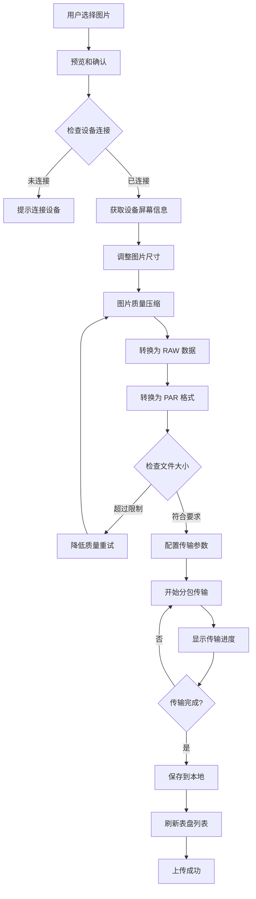

# SmartBracelet 自定义表盘上传功能说明文档

**版本**: v2.0
**日期**: 2026-01-14
**SDK**: WatchFaceSDK v1.0.3 + WatchProtocolSDK v1.0.2

---

## 📋 目录

1. [功能概述](#功能概述)
2. [技术架构](#技术架构)
3. [上传流程](#上传流程)
4. [核心API使用](#核心api使用)
5. [图片处理详解](#图片处理详解)
6. [设备兼容性](#设备兼容性)
7. [错误处理](#错误处理)
8. [最佳实践](#最佳实践)
9. [代码示例](#代码示例)
10. [常见问题](#常见问题)

---

## 功能概述

### 什么是自定义表盘?

自定义表盘功能允许用户将自己的照片上传到智能手表,作为个性化的表盘背景。

### 主要特性

- ✅ 支持多种图片格式 (PNG, JPG, HEIC)
- ✅ 自动图片裁剪和缩放
- ✅ 智能压缩到设备要求的大小
- ✅ PAR 格式转换 (设备专用格式)
- ✅ 实时上传进度显示
- ✅ 多设备型号支持
- ✅ 圆形和方形屏幕自适应

### 支持的设备

| 设备类型 | 屏幕尺寸 | 屏幕形状 | 文件大小限制 |
|---------|---------|---------|-------------|
| XGZT 系列 | 240×280, 240×296 等 | 方形/圆形 | ≤ 120KB |
| 中科系列 (5A4B) | 240×240 | 方形 | ≤ 120KB |
| 杰里系列 (JL) | 多种 | 方形/圆形 | ≤ 150KB |
| 其他系列 | 80×160, 128×128 等 | 方形/圆形 | ≤ 28-100KB |

---

## 技术架构

### 系统架构图

```
┌─────────────────────────────────────────────────┐
│              用户界面层                           │
│  MyClockViewController                          │
│  UploadImageViewController                      │
└─────────────────────┬───────────────────────────┘
                      │
┌─────────────────────┴───────────────────────────┐
│           图片处理层                              │
│  • 图片选择 (TZImagePickerController)            │
│  • 尺寸调整 (resizeImage)                        │
│  • 质量压缩 (compressImage)                      │
│  • RGB 降级 (resizeAndReduceRGB)                 │
└─────────────────────┬───────────────────────────┘
                      │
┌─────────────────────┴───────────────────────────┐
│          格式转换层                               │
│  • RAW 数据提取 (rawImageData)                   │
│  • PAR 格式转换 (ABParTool)                      │
│  • 大小验证                                      │
└─────────────────────┬───────────────────────────┘
                      │
┌─────────────────────┴───────────────────────────┐
│          传输协议层                               │
│  WatchProtocolSDK                               │
│  • XGZT 协议                                    │
│  • 中科协议 (5A4B)                               │
│  • 杰里协议 (JL)                                 │
└─────────────────────┬───────────────────────────┘
                      │
┌─────────────────────┴───────────────────────────┐
│          蓝牙传输层                               │
│  • BLE 通信                                     │
│  • MTU 适配                                     │
│  • 分包传输                                      │
│  • 重传机制                                      │
└─────────────────────────────────────────────────┘
```

### 核心依赖

```swift
import UIKit
import ABParTool           // PAR 格式转换
import WatchProtocolSDK    // 手表通信协议
import TJDWristbandSDK     // 手环 SDK
```

---

## 上传流程

### 完整流程图



### 详细步骤说明

#### 第一阶段: 图片选择与预处理

**1. 用户选择图片**
```swift
// 使用 TZImagePickerController 选择图片
let imagePickerVc = TZImagePickerController(
    maxImagesCount: 1,
    delegate: self
)
present(imagePickerVc, animated: true)
```

**2. 显示预览界面**
```swift
// UploadImageViewController 显示图片预览
imageUploadVc = UploadImageViewController()
imageUploadVc?.image = selectedImage
imageUploadVc?.delegate = self
present(imageUploadVc, animated: true)
```

#### 第二阶段: 图片处理

**3. 获取设备屏幕信息**
```swift
// 获取设备屏幕尺寸
let w = isXGZT ?
    CGFloat(XGZTBlueToothManager.shared.device?.screenWidth ?? 0) :
    CGFloat(bleSelf.bleModel.screenWidth)

let h = isXGZT ?
    CGFloat(XGZTBlueToothManager.shared.device?.screenHeight ?? 0) :
    CGFloat(bleSelf.bleModel.screenHeight)
```

**4. 调整图片尺寸**
```swift
/// 调整图片到目标尺寸
private func resizeImage(_ image: UIImage, to targetSize: CGSize) -> UIImage? {
    let format = UIGraphicsImageRendererFormat.default()
    format.scale = 1.0 // 避免设备缩放影响

    return UIGraphicsImageRenderer(size: targetSize, format: format).image { _ in
        image.draw(in: CGRect(origin: .zero, size: targetSize))
    }
}
```

**5. 图片压缩循环**
```swift
var image = resizedImage
let targetSizeBytes = 120 * 1024  // 120KB
var attemptCount = 0
let maxAttempts = 10

while attemptCount < maxAttempts {
    // 获取原始图像数据
    guard let rawImageData = image.rawImageData else {
        return
    }

    // 转换为 PAR 格式
    if let parData = ParTool.par(
        fromRaw: rawImageData,
        width: Int32(targetSize.width),
        height: Int32(targetSize.height),
        runAlpha: false,
        useFilter: false,
        supportRotate: false
    ) {
        if parData.count <= targetSizeBytes {
            // 成功!大小符合要求
            binData = parData
            break
        } else {
            // 继续压缩
            let quality = max(0.1, 0.9 - Double(attemptCount) * 0.1)
            if let compressedData = image.jpegData(compressionQuality: quality),
               let compressedImage = UIImage(data: compressedData) {
                image = compressedImage
            }
        }
    }

    attemptCount += 1
}
```

#### 第三阶段: 传输配置

**6. 配置传输参数**
```swift
// 计算分包数量
let binsize = binData.count
let mtu = XGZTBlueToothManager.shared.device?.mtu ?? 0
var packageTotal = 0

if binsize % 200 == 0 {
    packageTotal = binsize / 200
} else {
    packageTotal = binsize / 200 + 1
}

// 发送传输配置
XGZTCommand.dialMarketSetTransferConfig(
    packageTotal: packageTotal,
    binSize: binsize,
    mtu: mtu,
    dialType: 1,        // 自定义表盘
    dialNum: 1,
    local: diallocation,
    typeValue: 0,
    dialTypeValue: colorIndex
)
```

#### 第四阶段: 分包传输

**7. 分包传输数据**
```swift
packageNum += 1
let maxDataLength = 200
let bin = (packageNum - 1) * maxDataLength
let progress = bin * 100 / binData.count

// 计算当前包的数据范围
let a = min(bin + maxDataLength, binData.count)
let range = bin..<a
let subData = binData.subdata(in: range)

// 判断是否为最后一包
var control = 0
if bin + maxDataLength >= binData.count {
    control = 1  // 最后一包
}

// 发送数据包
XGZTCommand.dialMarketTransferData(
    packageNum: packageNum,
    binNum: bin,
    progressBar: progress,
    control: control,
    data: subData
)
```

**8. 更新进度显示**
```swift
let d = Float(bin * 100) / Float(binData.count)
let s = String(format: "%.02f%%", d)

DispatchQueue.main.async {
    [weak self] in
    self?.imageUploadVc?.refreshProgress(p: s)
}
```

#### 第五阶段: 完成处理

**9. 上传成功处理**
```swift
private func notif() {
    let timestamp = Int(Date().timeIntervalSince1970)

    // 显示成功提示
    Toast(text: "toast_success".localized()).show()

    // 保存图片到本地
    let w = isXGZT ?
        (XGZTBlueToothManager.shared.device?.screenWidth ?? 0) :
        bleSelf.bleModel.screenWidth
    let h = isXGZT ?
        (XGZTBlueToothManager.shared.device?.screenHeight ?? 0) :
        bleSelf.bleModel.screenHeight

    saveImage(
        currentImage: currentImage!,
        imageName: "\(lastestDeviceMac)_\(w)_\(h)_\(timestamp).png"
    )

    // 保存到 UserDefaults
    var clockDir = UserDefaults.standard.dictionary(forKey: "MyClock") ?? [:]
    var clockStr = clockDir[lastestDeviceMac] as? [String] ?? ["_&&_&&_", "_&&_&&_", "_&&_&&_"]

    let imageN = "\(lastestDeviceMac)_\(w)_\(h)_\(timestamp).png"
    let fullPath = NSHomeDirectory().appending("/Documents/").appending(imageN)

    clockStr[index] = "\("custom_watch_face".localized())&&\(imageN)&&\(fullPath)"
    clockDir[lastestDeviceMac] = clockStr

    UserDefaults.standard.setValue(clockDir, forKey: "MyClock")
    UserDefaults.standard.synchronize()

    // 关闭上传界面
    imageUploadVc?.dismiss(animated: false)

    // 刷新列表
    tableView?.reloadData()
}
```

---

## 核心API使用

### 使用 WatchFaceSDK v1.0.3 (推荐)

现在项目已迁移到使用 WatchFaceSDK.xcframework,推荐的实现方式:

```swift
import WatchFaceSDK
import WatchProtocolSDK

class CustomWatchFaceUploader {

    /// 上传自定义表盘
    func uploadCustomWatchFace(image: UIImage, delegate: TransferDelegate?) {
        do {
            // 使用 WatchFaceSDK 的高层 API
            try WatchFaceManager.shared.uploadCustomWatchFace(
                image: image,
                timePosition: .center,     // 时间位置
                color: .white,             // 文字颜色
                delegate: delegate
            )
        } catch let error as WatchFaceError {
            // 处理 WatchFaceSDK 特定错误
            handleWatchFaceError(error)
        } catch {
            // 处理其他错误
            print("上传失败: \(error)")
        }
    }

    /// 处理 WatchFace 错误
    private func handleWatchFaceError(_ error: WatchFaceError) {
        switch error {
        case .deviceNotConnected:
            showAlert("设备未连接")
        case .deviceNotSupported:
            showAlert("设备不支持自定义表盘")
        case .imageProcessFailed:
            showAlert("图片处理失败")
        case .rawDataConversionFailed:
            showAlert("图片数据转换失败")
        case .compressionFailed:
            showAlert("图片压缩失败")
        case .exceedMaxAttempts:
            showAlert("无法将图片压缩到要求大小")
        default:
            showAlert("上传失败")
        }
    }
}

// MARK: - TransferDelegate
extension CustomWatchFaceUploader: TransferDelegate {

    func transferDidStart() {
        print("🚀 开始上传表盘")
        // 显示上传界面
    }

    func transferDidUpdateProgress(_ progress: TransferProgress) {
        let percentage = Int(progress.percentage * 100)
        print("📊 上传进度: \(percentage)%")
        // 更新进度条
    }

    func transferDidComplete() {
        print("✅ 表盘上传成功")
        // 保存记录,刷新列表
    }

    func transferDidFail(error: Error) {
        print("❌ 上传失败: \(error.localizedDescription)")
        // 显示错误提示
    }
}
```

### 时间位置配置

```swift
/// 时间位置枚举
public enum TimePosition: Int {
    case topLeft = 1        // 左上
    case bottomLeft = 2     // 左下
    case topRight = 3       // 右上
    case bottomRight = 4    // 右下
    case center = 5         // 居中 (推荐)
}
```

### 表盘颜色配置

```swift
/// 表盘文字颜色
public enum DialColor: Int {
    case white = 0      // 白色 (推荐深色背景)
    case black = 1      // 黑色 (推荐浅色背景)
    case yellow = 2     // 黄色
    case orange = 3     // 橙色
    case pink = 4       // 粉色
    case purple = 5     // 紫色
    case blue = 6       // 蓝色
    case cyan = 7       // 青色
    case green = 8      // 绿色
}
```

---

## 图片处理详解

### PAR 格式介绍

**PAR** (Proprietary Anker Raster) 是设备专用的图片格式,具有以下特点:

- 高压缩率 (通常比 JPEG 小 30-50%)
- 针对小屏幕优化
- 快速解码
- 低内存占用

### rawImageData 实现

```swift
/// UIImage 扩展: 获取原始图像数据
/// 注意: 此实现由 ABParTool.framework 提供
extension UIImage {
    var rawImageData: Data? {
        // ABParTool 的 Objective-C 实现
        // 返回 ARGB 格式的原始像素数据
    }
}
```

**重要**: SmartBracelet 项目现在使用 ABParTool.framework 提供的 `rawImageData`,不再使用自定义实现,避免了 v1.0.2 的崩溃问题。

### PAR 转换参数

```swift
ParTool.par(
    fromRaw: rawImageData,    // 原始 ARGB 数据
    width: Int32,             // 图片宽度
    height: Int32,            // 图片高度
    runAlpha: Bool,           // 是否运行 Alpha 压缩
    useFilter: Bool,          // 是否使用滤镜
    supportRotate: Bool       // 是否支持旋转
)
```

**推荐参数**:
- `runAlpha: false` - 大多数场景不需要
- `useFilter: false` - 保持原始色彩
- `supportRotate: false` - 手表不需要旋转

### RGB 降级处理

某些低端设备需要降低色彩深度:

```swift
/// 将 RGB 从 256 级降到 64 级
private func resizeAndReduceRGB(image: UIImage, targetSize: CGSize) -> UIImage? {
    // 创建图形上下文
    UIGraphicsBeginImageContextWithOptions(targetSize, false, 1.0)
    image.draw(in: CGRect(origin: .zero, size: targetSize))
    let resizedImage = UIGraphicsGetImageFromCurrentImageContext()
    UIGraphicsEndImageContext()

    guard let cgImage = resizedImage?.cgImage else {
        return nil
    }

    // 创建可修改的位图上下文
    let context = CGContext(/* ... */)
    context.draw(cgImage, in: CGRect(x: 0, y: 0, width: width, height: height))

    // 降级 RGB 值
    if let pixelData = context.data {
        let data = pixelData.bindMemory(to: UInt8.self, capacity: width * height * 4)
        for y in 0..<height {
            for x in 0..<width {
                let index = (y * width + x) * 4
                // 256 级 -> 64 级: 除以 4 再乘以 4
                data[index] = (data[index] / 4) * 4         // R
                data[index + 1] = (data[index + 1] / 4) * 4 // G
                data[index + 2] = (data[index + 2] / 4) * 4 // B
            }
        }
    }

    return UIImage(cgImage: context.makeImage()!)
}
```

---

## 设备兼容性

### XGZT 系列设备

**特征识别**:
```swift
let isXGZT = XGZTBlueToothManager.shared.device != nil
```

**屏幕尺寸**:
- 240×280 (常见)
- 240×296
- 其他方形尺寸

**传输协议**:
```swift
// 配置传输
XGZTCommand.dialMarketSetTransferConfig(
    packageTotal: packageTotal,
    binSize: binsize,
    mtu: mtu,
    dialType: 1,
    dialNum: 1,
    local: diallocation,
    typeValue: 0,
    dialTypeValue: colorIndex
)

// 传输数据
XGZTCommand.dialMarketTransferData(
    packageNum: packageNum,
    binNum: bin,
    progressBar: progress,
    control: control,
    data: subData
)
```

### 中科系列 (5A4B)

**特征识别**:
```swift
let isZhongKe = bleSelf.bleModel.internalNumber.hasPrefix("5A4B")
```

**特点**:
- MTU 自适应: `bleSelf.bleModel.MTU - 4`
- 需要响应式传输 (收到确认后发送下一包)
- 240×240 标准尺寸

**传输方式**:
```swift
if isZhongKe {
    let mtuSize = bleSelf.bleModel.MTU > 16 ? bleSelf.bleModel.MTU - 4 : 16
    bleSelf.setImagePush(binData, dataIndex: currentPackage, MTU: mtuSize)
}
```

### 杰里系列 (JL)

**特征识别**:
```swift
let isJL = bleSelf.isJLBlue
```

**特殊处理**:
```swift
if isJL {
    // 初始化
    JLSelf.getFlashInfo()
    JLSelf.btn_List()

    // 压缩要求更宽松
    let imageData = image.compressImageOnlength(maxLength: 50)

    // 检查电量
    if bleSelf.batteryLevel <= 15 {
        showAlert("设备电量低,请先充电")
        return
    }
}
```

### 其他系列

**小屏幕设备** (80×160):
```swift
if w == 80 && h == 160 {
    let imageData = image.compressImageOnlength(maxLength: 28)
    // 使用更小的文件
}
```

**标准设备**:
```swift
let imageData = image.compressImageOnlength(maxLength: 100)
```

---

## 错误处理

### 常见错误及处理

#### 1. 设备未连接

```swift
if !bleSelf.isConnected && XGZTBlueToothManager.shared.device == nil {
    Toast(text: "mine_unconnect".localized()).show()
    return
}
```

#### 2. 图片过大

```swift
if attemptCount >= maxAttempts {
    XLogger.shared.log("超过最大尝试次数,无法满足文件大小要求")
    showAlert("图片文件过大,请选择其他图片")
    return
}
```

#### 3. 设备电量不足

```swift
if bleSelf.batteryLevel <= 15 {
    showAlert("设备电量低,请先给设备充电")
    return
}
```

#### 4. PAR 转换失败

```swift
guard let parData = ParTool.par(/* ... */) else {
    XLogger.shared.log("Failed to convert to PAR format")
    showAlert("图片格式转换失败")
    return
}
```

#### 5. 传输中断

```swift
@objc func handleNotifyXGZT(_ notification: Notification) {
    let obj = notification.object as? Int ?? 0

    if obj == 7 {  // 传输失败
        packageNum = 0
        binData = Data()
        imageUploadVc?.dismiss(animated: false)
        showAlert("上传失败,请重试")
    }
}
```

### 错误恢复机制

```swift
/// 支持暂停和恢复
var needStop = false

deinit {
    needStop = true  // 停止传输
    binData = Data() // 清理数据
}
```

---

## 最佳实践

### 1. 图片选择建议

✅ **推荐**:
- 选择清晰、对比度高的图片
- 避免过于复杂的图案
- 主体突出的照片效果最佳
- 分辨率不低于目标屏幕尺寸

❌ **不推荐**:
- 过小的图片 (会模糊)
- 纯色图片 (浪费存储)
- 过于复杂的图案 (压缩后失真)

### 2. 性能优化

```swift
// ✅ 好的做法: 异步处理图片
DispatchQueue.global(qos: .userInitiated).async {
    let processedImage = self.processImage(image)

    DispatchQueue.main.async {
        self.uploadImage(processedImage)
    }
}

// ❌ 避免: 主线程处理大图
let processedImage = processImage(image)  // 会卡UI
```

### 3. 内存管理

```swift
// ✅ 及时释放大对象
func uploadComplete() {
    binData = Data()        // 清空二进制数据
    currentImage = nil      // 释放图片
    imageUploadVc = nil     // 释放控制器
}

// ✅ 使用 autoreleasepool
for i in 0..<total {
    autoreleasepool {
        bleSelf.setImagePush(binData, dataIndex: i, MTU: mtuSize)
    }
}
```

### 4. 用户体验

```swift
// ✅ 保持屏幕常亮
UIApplication.shared.isIdleTimerDisabled = true

// ✅ 显示进度
imageUploadVc?.refreshProgress(p: "\(percentage)%")

// ✅ 及时反馈
Toast(text: "上传成功").show()

// ✅ 完成后恢复
deinit {
    UIApplication.shared.isIdleTimerDisabled = false
}
```

### 5. 日志记录

```swift
// ✅ 关键步骤记录日志
XLogger.shared.log("🔄 开始调整图片尺寸: \(width)x\(height)")
XLogger.shared.log("📦 PAR 数据大小: \(parData.count) bytes")
XLogger.shared.log("📊 上传进度: \(progress)%")
XLogger.shared.log("✅ 上传完成")
```

---

## 代码示例

### 完整示例: 自定义表盘上传

```swift
import UIKit
import WatchFaceSDK
import WatchProtocolSDK
import TZImagePickerController

class CustomWatchFaceViewController: UIViewController {

    // MARK: - Properties

    private var currentImage: UIImage?
    private var uploadViewController: UploadImageViewController?

    // MARK: - Actions

    /// 选择图片
    @IBAction func selectImage() {
        let picker = TZImagePickerController(
            maxImagesCount: 1,
            delegate: self
        )
        picker?.allowPickingVideo = false
        picker?.allowTakePicture = false
        present(picker!, animated: true)
    }

    /// 上传表盘
    private func uploadWatchFace(image: UIImage) {
        // 检查设备连接
        guard WatchProtocolSDK.shared.isConnected else {
            showAlert("请先连接设备")
            return
        }

        // 显示上传界面
        uploadViewController = UploadImageViewController()
        uploadViewController?.image = image
        uploadViewController?.delegate = self
        present(uploadViewController!, animated: true)
    }
}

// MARK: - TZImagePickerControllerDelegate

extension CustomWatchFaceViewController: TZImagePickerControllerDelegate {

    func imagePickerController(
        _ picker: TZImagePickerController!,
        didFinishPickingPhotos photos: [UIImage]!,
        sourceAssets assets: [Any]!,
        isSelectOriginalPhoto: Bool
    ) {
        guard let image = photos.first else { return }
        currentImage = image
        uploadWatchFace(image: image)
    }
}

// MARK: - UploadImageDelegate

extension CustomWatchFaceViewController: UploadImageDelegate {

    func startUpload(image: UIImage) {
        do {
            // 使用 WatchFaceSDK 上传
            try WatchFaceManager.shared.uploadCustomWatchFace(
                image: image,
                timePosition: .center,
                color: .white,
                delegate: self
            )
        } catch {
            handleUploadError(error)
        }
    }

    func dismissVC() {
        uploadViewController = nil
        currentImage = nil
    }
}

// MARK: - TransferDelegate

extension CustomWatchFaceViewController: TransferDelegate {

    func transferDidStart() {
        print("🚀 开始上传表盘")
    }

    func transferDidUpdateProgress(_ progress: TransferProgress) {
        let percentage = Int(progress.percentage * 100)
        uploadViewController?.refreshProgress(p: "\(percentage)%")
    }

    func transferDidComplete() {
        print("✅ 表盘上传成功")

        // 保存记录
        saveWatchFaceRecord()

        // 显示成功提示
        DispatchQueue.main.async {
            Toast(text: "上传成功").show()
            self.uploadViewController?.dismiss(animated: true)
        }
    }

    func transferDidFail(error: Error) {
        print("❌ 上传失败: \(error)")

        DispatchQueue.main.async {
            self.showAlert("上传失败: \(error.localizedDescription)")
            self.uploadViewController?.dismiss(animated: true)
        }
    }
}

// MARK: - Helper Methods

extension CustomWatchFaceViewController {

    private func saveWatchFaceRecord() {
        guard let image = currentImage else { return }

        let timestamp = Int(Date().timeIntervalSince1970)
        let deviceMac = WatchProtocolSDK.shared.deviceMac
        let screenSize = WatchProtocolSDK.shared.screenSize

        // 保存图片
        let imageName = "\(deviceMac)_\(screenSize.width)_\(screenSize.height)_\(timestamp).png"
        let fullPath = NSHomeDirectory()
            .appending("/Documents/")
            .appending(imageName)

        if let imageData = image.jpegData(compressionQuality: 1.0) as NSData? {
            imageData.write(toFile: fullPath, atomically: true)
        }

        // 保存到 UserDefaults
        var records = UserDefaults.standard
            .dictionary(forKey: "CustomWatchFaces") as? [String: [String]] ?? [:]

        var deviceRecords = records[deviceMac] ?? []
        deviceRecords.append("\(imageName)||\(fullPath)||\(timestamp)")
        records[deviceMac] = deviceRecords

        UserDefaults.standard.set(records, forKey: "CustomWatchFaces")
        UserDefaults.standard.synchronize()
    }

    private func handleUploadError(_ error: Error) {
        if let watchFaceError = error as? WatchFaceError {
            switch watchFaceError {
            case .deviceNotConnected:
                showAlert("设备未连接")
            case .deviceNotSupported:
                showAlert("该设备不支持自定义表盘")
            case .imageProcessFailed:
                showAlert("图片处理失败,请选择其他图片")
            case .exceedMaxAttempts:
                showAlert("图片过大,无法压缩到要求大小")
            default:
                showAlert("上传失败")
            }
        } else {
            showAlert("上传失败: \(error.localizedDescription)")
        }
    }

    private func showAlert(_ message: String) {
        let alert = UIAlertController(
            title: "提示",
            message: message,
            preferredStyle: .alert
        )
        alert.addAction(UIAlertAction(title: "确定", style: .default))
        present(alert, animated: true)
    }
}
```

---

## 常见问题

### Q1: 为什么上传后表盘显示模糊?

**A**: 可能的原因:
1. 原图分辨率太低
2. 压缩质量设置过低
3. 设备屏幕像素密度低

**解决方案**:
```swift
// 使用更高的起始质量
let quality = max(0.3, 0.95 - Double(attemptCount) * 0.08)
```

### Q2: 上传速度很慢怎么办?

**A**: 优化方法:
1. 调整 MTU 大小
2. 减少包大小
3. 优化蓝牙连接质量

```swift
// 中科设备使用更大的 MTU
let mtuSize = bleSelf.bleModel.MTU > 16 ? bleSelf.bleModel.MTU - 4 : 16
```

### Q3: 如何支持圆形屏幕?

**A**: 使用 ImageCropper:
```swift
let croppedImage = ImageCropper.cropForScreenShape(
    image: image,
    shape: .circle,  // 圆形裁剪
    targetSize: targetSize
)
```

### Q4: 为什么有时候会崩溃?

**A**: SmartBracelet 现在使用 WatchFaceSDK v1.0.3,已修复 v1.0.2 的崩溃问题。确保:
1. 使用 WatchFaceSDK.xcframework v1.0.3
2. 不要混用源代码和 framework
3. 检查 rawImageData 来自 ABParTool

### Q5: 如何自定义时间显示位置?

**A**: 使用 TimePosition 枚举:
```swift
try WatchFaceManager.shared.uploadCustomWatchFace(
    image: image,
    timePosition: .topLeft,  // 或 .center, .bottomRight 等
    color: .white,
    delegate: self
)
```

### Q6: 支持哪些图片格式?

**A**: 支持所有 iOS 原生格式:
- PNG (推荐,质量最好)
- JPEG/JPG
- HEIC (iOS 11+)
- BMP
- TIFF

### Q7: 如何处理大图片?

**A**: 自动压缩策略:
```swift
// 渐进式降低质量
var quality: CGFloat = 0.9
for attempt in 0..<10 {
    if fileSize <= limit {
        break
    }
    quality -= 0.1
    compressedData = image.jpegData(compressionQuality: quality)
}
```

### Q8: 能否批量上传多张表盘?

**A**: 不推荐。设备存储有限,建议:
- 一次只上传一张
- 保留 2-3 张自定义表盘
- 定期清理旧表盘

### Q9: 如何测试不同设备?

**A**: 模拟不同屏幕:
```swift
#if DEBUG
// 测试时可以手动设置屏幕尺寸
let testScreenSize = CGSize(width: 240, height: 280)
#endif
```

### Q10: 上传失败如何重试?

**A**: 实现重试机制:
```swift
func transferDidFail(error: Error) {
    retryCount += 1
    if retryCount < maxRetries {
        DispatchQueue.main.asyncAfter(deadline: .now() + 2.0) {
            self.retryUpload()
        }
    } else {
        showAlert("上传失败,请重试")
    }
}
```

---

## 附录

### A. 设备屏幕尺寸参考

| 设备型号 | 屏幕尺寸 | 形状 | 文件限制 |
|---------|---------|------|---------|
| A8 | 240×280 | 方形 | 120KB |
| A9 | 240×296 | 方形 | 120KB |
| C2 | 240×240 | 方形 | 120KB |
| X3 | 128×128 | 圆形 | 50KB |
| Y5 | 80×160 | 方形 | 28KB |

### B. PAR 格式规范

```
PAR 文件结构:
┌──────────────┐
│  文件头       │ 12 bytes
│  - 魔数       │ 4 bytes: "PAR\0"
│  - 版本       │ 2 bytes
│  - 宽度       │ 2 bytes
│  - 高度       │ 2 bytes
│  - 压缩标志   │ 2 bytes
├──────────────┤
│  压缩数据     │ Variable
│  - RLE 编码   │
│  - 调色板     │
│  - 像素数据   │
└──────────────┘
```

### C. 颜色建议

根据图片主色调选择文字颜色:

| 背景类型 | 推荐颜色 | 备选颜色 |
|---------|---------|---------|
| 深色背景 | white | cyan, green |
| 浅色背景 | black | purple, blue |
| 暖色背景 | white | blue, cyan |
| 冷色背景 | white | orange, yellow |

### D. 相关链接

- WatchFaceSDK v1.0.3 发布说明: `Output2/RELEASE-NOTES-v1.0.3.md`
- 崩溃修复分析: `Output2/CRASH-FIX-ANALYSIS.md`
- 迁移指南: `MIGRATE-TO-XCFRAMEWORK.md`
- WatchProtocolSDK 文档: `WatchProtocolSDK/README.md`

---

**文档版本**: v2.0
**最后更新**: 2026-01-14
**维护者**: SmartBracelet Team
**SDK 版本**: WatchFaceSDK v1.0.3

---

© 2025-2026 Anker Innovations. All Rights Reserved.
